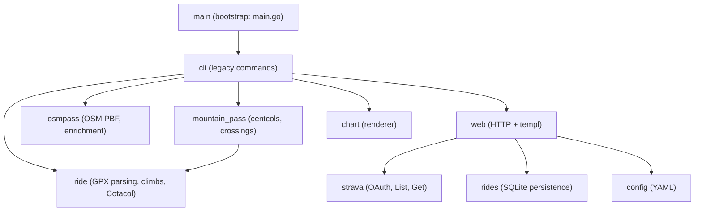

# biking_home — cycling ride analysis

A Go toolkit for analyzing cycling rides from GPX exports: parse rides, detect climbs, score their difficulty, match the same climb across rides, and download French mountain passes into SQLite.

## Features

- **GPX parsing** — reads elevation-tracked rides from Garmin/Strava GPX exports into a `Ride` model
- **Climb detection** — automatically finds climbs within a ride, each scored and categorized (Cat 4 … HC)
- **Difficulty score (Cotacol)** — scores any ride or climb by splitting it into 100 m segments and summing `0.1 km × slope²` per segment
- **Similar-climb matching** — finds the same climb across rides by matching start/end coordinates, so times can be compared
- **Mountain pass download** — imports French mountain passes from centcols.org into a SQLite database
- **Pass crossing detection** — enriches passes with OSM coordinates, flags which passes a ride crosses, and names each climb after the pass it tops (e.g. "Col de Castellaras")
- **Plots** — renders elevation and score-profile charts as PNG
- **Web ride library** — starts a local web server by default, imports Strava rides over a date range, stores metadata in SQLite, and keeps their GPX files on disk

## Getting started

```bash
go build -o biking_home .
```

## Usage

```bash
# Start the web server on http://localhost:8080
./biking_home

# Download French mountain passes into biking_home.db (SQLite)
./biking_home -download

# Resume an interrupted download, reusing departments already cached on disk
./biking_home -download -resume

# Run the climb-similarity and difficulty-score demo on the example rides
./biking_home -demo

# Import cached department CSVs (debug_department_06.csv, 13.csv) into the DB
./biking_home -import-cached

# Extract mountain passes from a France OSM PBF into the DB
./biking_home -extract-osm /path/to/france-latest.osm.pbf

# Backfill OSM coordinates onto passes (needs -extract-osm run first)
./biking_home -enrich

# Render an elevation chart with climb highlights and pass markers
./biking_home -chart examples/2023-06-17.AlpesVerdonTour.gpx

# Profile the demo with Go's CPU profiler
./biking_home -demo -cpuprofile /tmp/cpu.prof
```

## Options / Configuration

| Flag | Description | Default |
| --- | --- | --- |
| `-download` | Download mountain passes into the database | `false` |
| `-resume` | Skip departments already cached on disk | `false` |
| `-import-cached` | Import cached department CSVs into the database | `false` |
| `-extract-osm` | Extract mountain passes from a France OSM PBF | `""` |
| `-enrich` | Backfill OSM coordinates onto passes | `false` |
| `-chart` | Render an elevation chart (climbs + passes) for a GPX file | `""` |
| `-demo` | Run the climb-similarity demo | `false` |
| `-cpuprofile` | Write a CPU profile to file | `""` |

Configuration is stored in `config.yaml`. Start from `config.example.yaml` and set the Strava credentials before launching the server.

## Strava API

The Strava v3 API (OAuth2) is the platform's public access point; scopes gate each resource (`read`, `activity:read_all`, `activity:write`, `push:subscriptions`). It offers:

- **Activities** — list and fetch ride detail, plus data streams (lat/lng, altitude, time, distance, heart rate, cadence, power) to rebuild GPX or compute metrics
- **Segments** — explore segments, match segment efforts, pull personal records
- **Uploads** — create activities by pushing FIT, GPX or TCX files
- **Webhooks** — push subscriptions notify a callback URL on activity create/delete, enabling real-time sync
- **Extras** — clubs, routes, gear, photos, kudos

Standard apps are rate-limited to 100 calls per 15 minutes and 1,000 per day.

## Architecture

- Go 1.23; SQLite via `mattn/go-sqlite3`; charts via `gonum.org/v1/plot`
- `ride` — GPX parsing, climb detection, difficulty scores (KOM + Cotacol), similarity index
- `mountain_pass` — centcols.org department CSV download into SQLite, with disk caching and retries
- `osmpass` — OSM PBF extraction (`mountain_pass=yes` nodes) and pass coordinate enrichment
- `strava` — OAuth2 client returning activity metadata and GPX data
- `rides` — SQLite persistence for imported ride metadata
- `config` — typed YAML configuration and atomic persistence
- `web` — HTTP server, OAuth callback, sync orchestration, and templ pages
- `cli` — legacy mountain-pass, OSM, demo, and chart command handlers
- `chart` — elevation chart rendering
- **Notable choices** — the difficulty score follows the Cotacol method: the ride is split into fixed 100 m segments and each scores `distance_km × slope²`, so steep sections weigh exponentially more than long flat ones



## Development

```bash
mise run check
mise run build
```

## TODO

- Compute estimated power
- Plot speed and slope per segment, colored by heart rate
- Persist the chosen climb variant across activities
- Handle historical data
- Blog with pictures and markdown

## Resources

- [Climbfinder: difficulty points](https://climbfinder.com/en/difficulty-points) — the Cotacol formula behind the difficulty score
- [centcols.org](https://www.centcols.org) — French mountain pass reference used for the SQLite data
- [Pogacar 21 July 2022](https://www.strava.com/activities/7505784085) — example ride used for climb detection
- [gpxgo](https://github.com/tkrajina/gpxgo) — GPX parsing library
- [geodist](https://github.com/jftuga/geodist) — haversine distance used for climb matching
